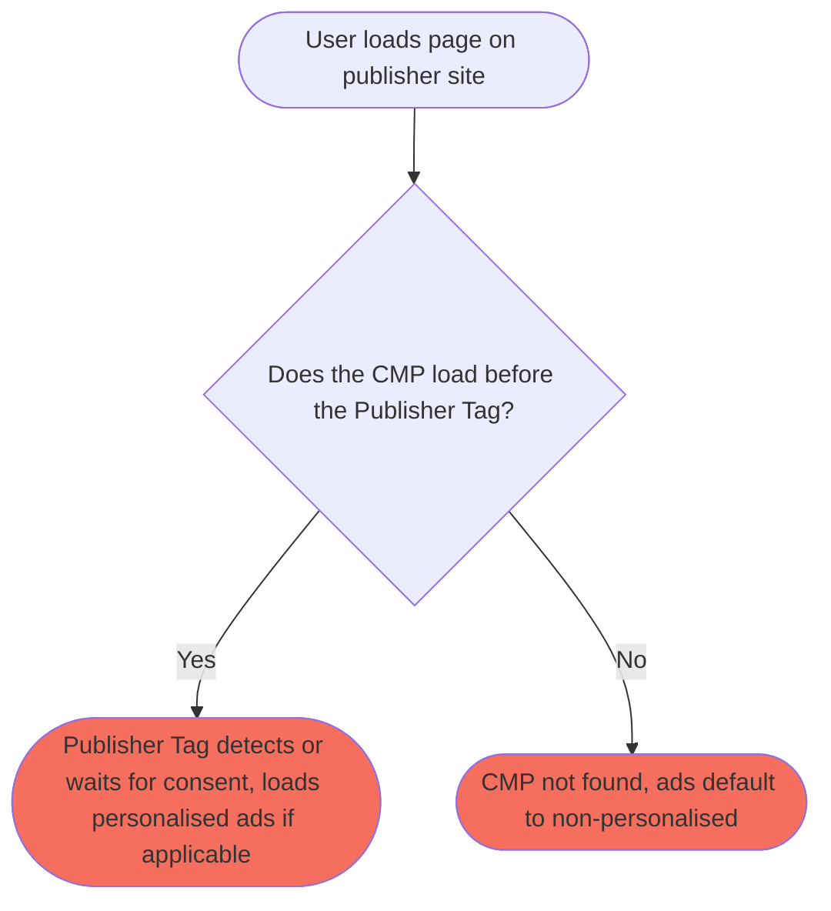
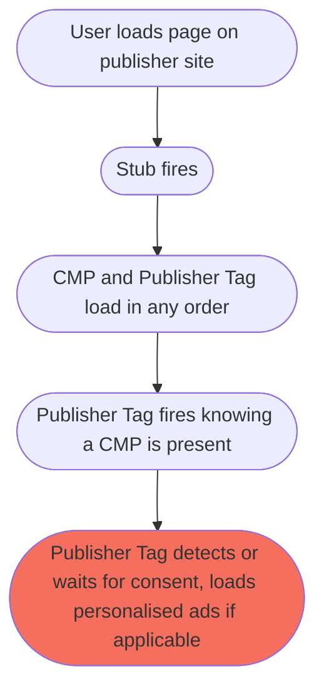

CMPs, or "Consent Management Platforms" are a vital part of a publisher's ad tech setup. CMPs are a component under the publisher's responsibility, and are unfortunately plagued with common pitfalls and easy to miss implementation mistakes.

The result of not getting your CMP setup right? Direct impact on monetisation.

## So what is a CMP?

A CMP's job is to collect consent from your users in regions where consent is legally required for sharing of personal data. This consent is then read by all parties in your ad stack, where consent means that users can be shown "Personalised Advertising".

Personalised advertising refers to ads targeted at specific users based on previous interactions while browsing the web. If someone has been shopping for shoes for example, then showing that user adverts of shoes is more likely to engage that user.
Higher engagement means higher monetisation. This is why consent is so important. Without it, ad serving defaults to "Non-personalised" in order to be compliant with the law, but in this mode, monetisation is often poor.

CMPs first appeared on the scene as a response to the European Union's GDPR law, requiring that users must opt-in to sharing data up front. This meant that every site that serves users in EU countries, would need a way to collect consent.

But how could this be done in a uniform way so that all sites could easily pass on user consent to any third party that needed to read it? Enter "TCF", or the Transparency & Consent Framework, introduced by the IAB (a governing body in the advertising world).

The goal of TCF was to have a single universal framework that all CMPs adhered to, so that any third party would know how to read user consent, regardless of what CMP the publisher chose to use. Luckily this was widely adopted, and is the expected way to collect and read user consent.

All of this behind-the-scenes tech is of little concern to you, the publisher, other then making sure the CMP you pick is TCF-compatible (you'd be hard pressed to find one that isn't).

### The rest of the world

While GDPR triggered the creation of CMPs and the development of TCF, other countries soon began considering their own stance on user data rights.

Countries like Canada and Brazil have their own laws, and states in the US have also brought in their own variations of GDPR.

Suddenly, the straightforward EU landscape, with its single GDPR law, became more complex when looking globally. There are nuances in each region's legal system, so once again, how can global publishers collect consent from individual users, and how can any third party read that consent?

The IAB's answer to this was "GPP", the Global Privacy Platform. Like TCF, the goal of GPP was to establish a single framework that all CMPs could adhere to so that all third parties would know how to read user consent.

However, GPP differs from TCF in that it encompasses the various global implementations of user consent, such as TCF (for Europe), TCF (for Canada), and California's privacy implementation.

<Note>
**Key Takeaway**

Ensure the CMP you pick is clearly listed as "TCF" or "GPP" compatible

</Note>

## Whose responsibility is the CMP?

Responsibility for choosing and implementing a CMP is with you, the publisher. It is a legal requirement in several regions to collect consent correctly (with possible fines for non-compliance).

Because CMPs adhere to one of the frameworks mentioned above, as far as Content Ignite is concerned, it doesn't matter which CMP provider you choose, as long as it is implemented correctly (we'll come to this shortly).

It is important to us that you, the publisher, take full control over your users' data privacy. This is why we do not offer a pre-configured CMP for you to use "as-is".

However, we can help with getting your chosen CMP to page, as we [support a number of third party CMPs](/integrations/ad-tech#cmps) in our Fusion platform. This allows you to skip the implementation headaches, but this will always remain your choice and under your control.

## Implementation

So CMPs ask users for consent, and respond to a third party that asks about user consent. Easy, right?

Unfortunately while all the complexities are taken care of by the CMP itself, there are still several ways to implement a CMP incorrectly. In these cases, everything will appear to be working, which makes these issues so tricky to debug.

The number one issue with CMP implementation is ensuring third parties wait for user consent.

### Waiting for user consent

The first time a user visits your site, they will be shown your CMP of choice (if in a region that requires it). The CMP will ask the user to make a choice, typically "Accept all" of the data use cases (vendors and purposes), or "Reject all".

While the user is making their choice, it is really important that any third parties, such as advertising partners, know the user is actively choosing their response, so that they can wait for the user to finish.

In the world of ads, if we immediately loaded ads, we would see that the user has not consented to sharing data yet, so we would load non-personalised ads. But the user may have been about to select "Accept all", so this would have been a waste of an ad load. However, if we know that the user was picking their response, and waited for that to happen, then we could load personalised ads as soon as "Accept all" was chosen.

It goes even further than this. There are lots of situations that may occur that third parties need to be aware of. For example, if there is no CMP at all, there would be no use waiting around for user consent, when we could just load ads right away (non-personalised of course).

Now, down at a technical level (bear with us), there are two important things loading on the page in order for ads to load: your CMP of choice and your Content Ignite Publisher Tag. Our tag wants to read from the CMP to check we have user consent. But what if our tag loads before your CMP? Well, we would load, see there is no CMP, and then continue to load ads with personalisation **disabled**. But this might have missed that fact that user consent was present, the CMP just hadn't loaded yet!

This is where a third important script comes into the mix: The CMP "Stub"

### Stub

A CMP "Stub" is a small piece for Javascript code, that tells third parties that a CMP will be present.

It loads before any script that needs to read from a CMP, and before the CMP itself.

This is much more important than it may first seem. By knowing that a CMP is going to be present, if the CMP loads after your Publisher Tag, the Publisher Tag will still wait for user consent to be detected, because it **knows** it is coming.

Without a Stub, the following is possible:



With a Stub, the error routes are prevented:



<Note>
**Key Takeaway**

By not correctly implementing a CMP Stub, you introduce a "race condition", where sometimes the CMP will load before your Publisher Tag, and sometimes after. This leads to intermittent monetisation issues. So correctly implementing a Stub is vital.

</Note>

#### Implementation

This warrants a little background about the web (we'll try not to get too technical). Both the CMP and your Publisher Tag are linked to from the head of your page via a "script" tag. It might be obvious to think that the order in which you add these is the order in which they will load, but unfortunately, this is not the case. The browser will load each resource, but the speed at which they return determines which loads first. If the CMP is first up in the head of your page, but takes 2 seconds to load, but your Publisher Tag takes 1 second, then the Publisher Tag will load first.

This is important because you can never guarantee the firing order. It may swap around between page loads or vary depending on connection speed, such as mobile browsing on a 3G network, or even be affected by browser cache or plugins!

These differences in loading times and firing order are referred to as "race conditions", where both scripts are racing to load, with different outcomes possible each time the race is run.

With that being said, it is crucial to correctly implement the Stub to completely eliminate the chance of a race condition. The Stub needs to be placed directly in the head of your site, before your CMP and Publisher Tags are linked. It is vital to never put the Stub in an external file that is then linked to. If you were to link to an external file, you'd be introducing a new race condition where the the CMP or your Publisher Tag could load before the Stub, negating the Stub altogether. By including it directly in the head, there is no "fetching" of the file, so it is always loaded immediately.

{/* prettier-ignore */}
```html title='Example of what "direct in the head of your page" looks like'
<head>
    <!-- This is your stub code, the first thing to load ahead of your CMP and publisher tag. Code is directly inside the script tags -->
    <script>!function(){let e=()=>{let e="__tcfapiLocator",t=[],a=window,n=a,s,o;for(;n;){try{if(n.frames[e]){s=n;break}}catch(c){}if(n===a.top)break;n=n.parent}s||(!function t(){let n=a.document,s=!!a.frames[e];if(!s){if(n.body){let o=n.createElement("iframe");o.style.cssText="display:none",o.name=e,n.body.appendChild(o)}else setTimeout(t,5)}return!s}(),a.__tcfapi=function e(...a){if(!a.length)return t;"setGdprApplies"===a[0]?a.length>3&&2===parseInt(a[1],10)&&"boolean"==typeof a[3]&&(o=a[3],"function"==typeof a[2]&&a[2]("set",!0)):"ping"===a[0]?"function"==typeof a[2]&&a[2]({gdprApplies:o,cmpLoaded:!1,cmpStatus:"stub"}):t.push(a)},a.addEventListener("message",function e(t){let a="string"==typeof t.data,n={};if(a)try{n=JSON.parse(t.data)}catch(s){}else n=t.data;let o="object"==typeof n&&null!==n?n.__tcfapiCall:null;o&&window.__tcfapi(o.command,o.version,function(e,n){let s={__tcfapiReturn:{returnValue:e,success:n,callId:o.callId}};t&&t.source&&t.source.postMessage&&t.source.postMessage(a?JSON.stringify(s):s,"*")},o.parameter)},!1))};"undefined"!=typeof module?module.exports=e:e()}();</script>

    <!-- This is your CMP, loaded after the stub -->
    <script src="https://example.com/12345/cmp.js" async="async"></script>

    <!-- This is your Content Ignite publisher tag, loaded after the stub -->
    <script src="https://cdn.tagdeliver.com/cipt/12345.js" async="async"></script>
</head>
```

#### Vendor List

One key area of CMP configuration is the vendor list. This is a list of all the third parties that you want the user to consent to. It is important that Content Ignite and all the ad partners we integrate with, are listed. Without this, we will read our consent as missing, and default to non-personalised ads.

Most CMPs will enable all vendors by default, but it is always worth checking, especially if you plan to whittledown this list.

#### Example Stubs

It is worth noting that some CMP providers include a stub! Look out for a bit of text that reads `cmpStatus:"stub"`, and if you find it in the code you are deploying **directly in the head of your page (not in an external file)**, then you are all sorted!

For those who need a stub, its handy to know that they are simple, generic bits of code, and are not tied to the specific CMP you chose, all that matters is that they are implemented correctly (direct in the head of your site, before your CMP and Publisher Tag), and that you match against your CMPs framework:

**TCF Stub**

{/* prettier-ignore */}
```html
<script>
    !function(){let e=()=>{let e="__tcfapiLocator",t=[],a=window,n=a,s,o;for(;n;){try{if(n.frames[e]){s=n;break}}catch(c){}if(n===a.top)break;n=n.parent}s||(!function t(){let n=a.document,s=!!a.frames[e];if(!s){if(n.body){let o=n.createElement("iframe");o.style.cssText="display:none",o.name=e,n.body.appendChild(o)}else setTimeout(t,5)}return!s}(),a.__tcfapi=function e(...a){if(!a.length)return t;"setGdprApplies"===a[0]?a.length>3&&2===parseInt(a[1],10)&&"boolean"==typeof a[3]&&(o=a[3],"function"==typeof a[2]&&a[2]("set",!0)):"ping"===a[0]?"function"==typeof a[2]&&a[2]({gdprApplies:o,cmpLoaded:!1,cmpStatus:"stub"}):t.push(a)},a.addEventListener("message",function e(t){let a="string"==typeof t.data,n={};if(a)try{n=JSON.parse(t.data)}catch(s){}else n=t.data;let o="object"==typeof n&&null!==n?n.__tcfapiCall:null;o&&window.__tcfapi(o.command,o.version,function(e,n){let s={__tcfapiReturn:{returnValue:e,success:n,callId:o.callId}};t&&t.source&&t.source.postMessage&&t.source.postMessage(a?JSON.stringify(s):s,"*")},o.parameter)},!1))};"undefined"!=typeof module?module.exports=e:e()}();
</script>
```

Source:
[https://github.com/InteractiveAdvertisingBureau/GDPR-Transparency-and-Consent-Framework/](https://github.com/InteractiveAdvertisingBureau/GDPR-Transparency-and-Consent-Framework/blob/master/TCFv2/IAB%20Tech%20Lab%20-%20CMP%20API%20v2.md#is-there-a-sample-cmp-stub-api-script)

**GPP Stub**

{/* prettier-ignore */}
```html
<script>
    window.__gpp_addFrame=function(e){if(!window.frames[e]){if(document.body){var t=document.createElement("iframe");t.style.cssText="display:none",t.name=e,document.body.appendChild(t)}else window.setTimeout(window.__gppaddFrame,10,e)}},window.__gpp_stub=function(){var e=arguments;if(__gpp.queue=__gpp.queue||[],!e.length)return __gpp.queue;var t=e[0],a=e.length>1?e[1]:null,n=e.length>2?e[2]:null;if("ping"===t)return{gppVersion:"1.1",cmpStatus:"stub",cmpDisplayStatus:"hidden",supportedAPIs:["2:tcfeuv2","5:tcfcav1","6:uspv1"],cmpId:31,sectionList:[],applicableSections:[-1],gppString:""};if("addEventListener"===t){__gpp.events=__gpp.events||[],"lastId"in __gpp||(__gpp.lastId=0),__gpp.lastId++;var p=__gpp.lastId;return __gpp.events.push({id:p,callback:a,parameter:n}),{eventName:"listenerRegistered",listenerId:p,data:!0,pingData:{gppVersion:"1.1",cmpStatus:"stub",cmpDisplayStatus:"hidden",supportedAPIs:["2:tcfeuv2","5:tcfcav1","9:usva","7:usnat"],cmpId:31,sectionList:[],applicableSections:[-1],gppString:""}}}if("removeEventListener"===t){var s=!1;__gpp.events=__gpp.events||[];for(var i=0;i<__gpp.events.length;i++)if(__gpp.events[i].id==n){__gpp.events[i].splice(i,1),s=!0;break}return{eventName:"listenerRemoved",listenerId:n,data:s,pingData:{gppVersion:"1.1",cmpStatus:"stub",cmpDisplayStatus:"hidden",supportedAPIs:["2:tcfeuv2","5:tcfcav1","9:usva","7:usnat"],cmpId:31,sectionList:[],applicableSections:[-1],gppString:""}}}if("hasSection"===t||"getSection"===t||"getField"===t)return null;__gpp.queue.push([].slice.apply(e))},window.__gpp_msghandler=function(e){var t="string"==typeof e.data;try{var a=t?JSON.parse(e.data):e.data}catch(n){var a=null}if("object"==typeof a&&null!==a&&"__gppCall"in a){var p=a.__gppCall;window.__gpp(p.command,function(a,n){var s={__gppReturn:{returnValue:a,success:n,callId:p.callId}};e.source.postMessage(t?JSON.stringify(s):s,"*")},"parameter"in p?p.parameter:null,"version"in p?p.version:"1.1")}},"__gpp"in window&&"function"==typeof window.__gpp||(window.__gpp=window.__gpp_stub,window.addEventListener("message",window.__gpp_msghandler,!1),window.__gpp_addFrame("__gppLocator"));
</script>
```

Source:
[https://github.com/InteractiveAdvertisingBureau/Global-Privacy-Platform/](https://github.com/InteractiveAdvertisingBureau/Global-Privacy-Platform/blob/main/Core/CMP%20API%20Specification.md#examples)

### Caching plugins

There are certain plugins and services out there aimed at improving your site's speed and efficiency. One of such services is Cloudflare's "Rocketloader". One of the many things that Rocketloader (and other services) can do is defer Javascript.

What this means is it will block all JS from loading until the page content itself has loaded, and then it will allow the Javascript to load.

While this might improve the responsiveness of a page, it can mess with the firing order of your CMP and Publisher Tag. In addition, as latency is such an important metric for reviewing ad performance, delaying ads will almost certainly impact your monetisation.

So it is important to make sure your core ad tech scripts (CMP and Publisher Tag) are excluded from any caching plugins. For instructions on this, please review the documentation from your caching service.

### Let Fusion handle implementation

Getting all of this right can be a bit finicky, but is certainly doable. But even with the perfect set up, things might get accidentally changed. For example, your tech department migrates to a new site template and misses that fact that the scripts are now firing in a different order.

This is where we can help. By [using Fusion to deploy your CMP](/integrations/ad-tech#cmps), we can ensure it makes it to page before your Publisher Tag, and that CMP errors can be avoided. Fusion deployment negates the need for a Stub and simplifies implementation.

We have a number of CMPs integrated into Fusion, but if you don't see yours in there, reach out as we can likely add it for you.

## Tracking CMP stats

With so many pitfalls to avoid, it's important to be able to verify your setup and track CMP metrics over time.

This is where our [Diagnostics Insights Hub](/reporting/insights/diagnostics) comes in. Here we will tell our outright if your Stub has been found and what your error rate is. We'll also track the consent rates that we detect, ensuring you always have actionable insights at your fingertips.

Fusion is also geared up to scan and detect issues such as CMP consent rates and revenue, where it will alert you to sudden drop-offs, helping catch and accidental changes that may impact your ad setup.

## FAQ's

#### Question: So how do I pass consent from the CMP on to you, my ad tech partner?

Answer: You don't! With the Stub and CMP in place, we can communicate directly with the CMP, with no input from you. All just works as it should.

#### Question: Instead of a Stub, can't I just delay your Publisher Tag from loading?

Answer: This would be a very inefficient approach and would also still not guarantee that the CMP fires first. The Stub ensures we wait only as long as necessary; delaying us longer will impact monetisation.

#### Question: Can I use Google's CMP?

Answer: From our experience, Google's CMP is designed for direct use with Google Publisher Tag only, and doesn't work well as an independent CMP. Because Google is in control of both the CMP and the ad server, it can ensure that the CMP is loaded first and that consent is waited for, so does not require a Stub. Our publishers have found that when using Google's CMP by itself and implementing a Stub, the CMP fails to function correctly.

#### Question: My CMP provider, has provided a stub file to link to..

Answer: Shame on them! External stub files are just not valid. However, you can copy the file contents and put it direct in the head of your page, between script tags. E.g: `<script>__CODE_GOES_HERE__</script>`
