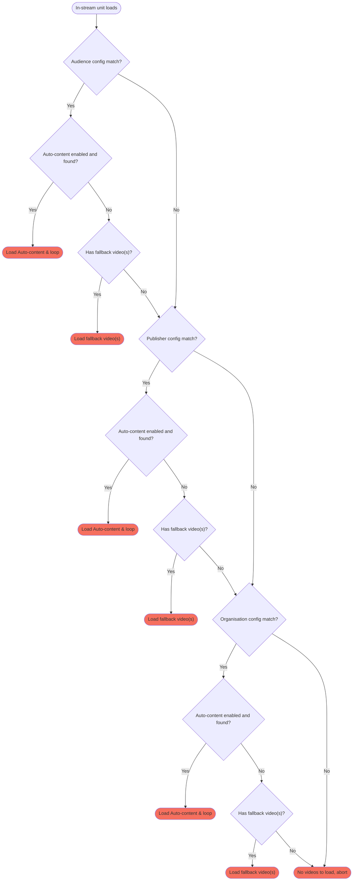

import Image from "/snippets/Image.jsx";

<Image
  src="video-configs.png"
  alt="Graphic of man piecing together a video player"
/>

Video configs allow you to configure the content that will serve to a video unit on your network. They work alongside unit configs (which control the targeting and behaviour of a video unit) to serve content and ads to your publishers in a highly configurable way.

Video configs can target everything across your network in one go (network default) or go more granular and target specific publishers or audiences. Use as many configs as needed to serve relevant content to your video units.

<video className="w-full aspect-video rounded-xl" controls>
  <source src="/assets/videos/ci-in-stream.mp4" type="video/mp4" />
  Your browser does not support the video tag.
</video>

A simple and fully functional set-up can use a single video config to enable auto-content across an organisation, with optional fallback videos. A more complex set-up may target individual audiences with audience-specific video playlists.

## Auto-content

Auto-content is a powerful system that builds videos on the fly. It allows you to tap into video monetisation without investing in your own video content creation, while also circulating users around your sites!

We either look to your RSS feed for the latest articles, or through our logs for the most popular articles. We then piece together a video using your article's title and feature image along with your publisher branding (logo and display name) to create bespoke video content. For each article shown, a "Read more" button is displayed linking to that article, circulating users around your site with all actions of course viewable from our reporting!

Content is periodically re-generated to keep it up-to-date. Each generated video is viewable from the video config that controls it, so you can always see what we are serving!

_NOTE:_ Please allow up to 30 minutes for your auto-content to be built upon the creation or implementation of change.

### Branding

Be sure to set your publisher's display name and logos inside publisher settings if you want these to be added to your auto-content video.

### RSS Feed

If you select the "Latest" content focus, then we will look for the RSS feed set in your publisher settings. This can be any URL, for example, you could use a 3rd party service to curate an RSS feed just for your video content!

**Your RSS feed must contain a `title`, `link`, `pubDate` and `media` or image `enclosure` field.**

### Rendering

Content is periodically re-generated to keep it up-to-date. Each generated video is viewable from the video config that controls it, so you can always see what we are serving.

We can fail to generate content for a number of reasons, so we make every effort to show you the reason for failure in the dashboard. Simply go to the relevant video config and select the target in the "Auto-content preview" section. Videos can fail if there is not enough content found, missing images in your RSS feed, RSS feed errors etc.

Also, be sure to set your publisher's display name (how you would like your brand to be written), and light and dark logos on the publisher settings page, so these can be added to your video.

## Video playlist

You can upload your own video content. This can be used instead of auto-content if you have your own video content/strategy or can be used as a fallback to auto-content if you want to guarantee video ad serving opportunity.

Simply upload your files (or drop in the link to any self-hosted content) and make your selection, dragging items to re-order as needed.

If auto-content is enabled, auto-content will always take precedence, and only fall back to your playlist when needed. See [video config hierarchy](/publishers/video-config#hierarchy).

## Targets

Targets are either the organisation you are logged in as, a publisher, or an audience.

Selecting your organisation means all publishers will inherit these settings by default. This will NOT create an organisation-level video via auto-content but will create one video per publisher where applicable.

Publisher and audience targets act as you would expect. Be aware that each target can only be used in one video config, and that when a page on a publisher's site matches more than one target, the more granular targets take precedence, see [video config hierarchy](/publishers/video-config#hierarchy).

## Hierarchy

You can target video content to your organisation (network default), individual publishers and audiences. Each target can only be used once, and the more granular targets take precedence.

For example, if you have a config set up for your entire network, another for a publisher and another for an audience, if a particular publisher page on site matches all three, the Audience config will be used, followed by the publisher config (if the audience is not matched) then by the organisation config.

